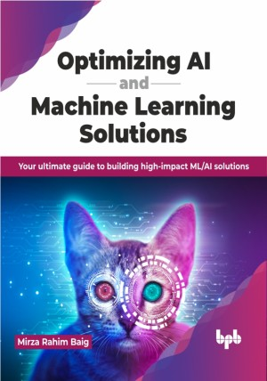

# Optimizing AI and Machine Learning Solutions

Build high-impact ML/AI solutions by optimizing each step

This is the repository for [Optimizing AI and Machine Learning Solutions
](https://bpbonline.com/products/optimizing-ai-and-machine-learning-solutions?variant=43280303718600),published by BPB Publications.

## About the Book
This book approaches data science solution building using a principled framework and case studies with extensive hands-on guidance. It will teach the readers optimization at each step, whether it is problem formulation or hyperparameter tuning for deep learning models.

This book keeps the reader pragmatic and guides them toward practical solutions by discussing the essential ML concepts, including problem formulation, data preparation, and evaluation techniques. Further, the reader will be able to learn how to apply model optimization with advanced algorithms, hyperparameter tuning, and strategies against overfitting. They will also benefit from deep learning by optimizing models for image processing, natural language processing, and specialized applications. The reader can put theory into practice with hands-on case studies and code examples, reinforcing their understanding.

With this book, the reader will be able to create high-impact, high-value ML/AI solutions by optimizing each step of the solution building process, which is the ultimate goal of every data science professional.

## What You Will Learn
• End-to-end solutions to ML/AI problems.

• Data augmentation and transfer learning.

• Optimizing AI/ML solutions at each step of development.

• Multiple hands-on real case studies.

• Choose between various ML/AI models.
